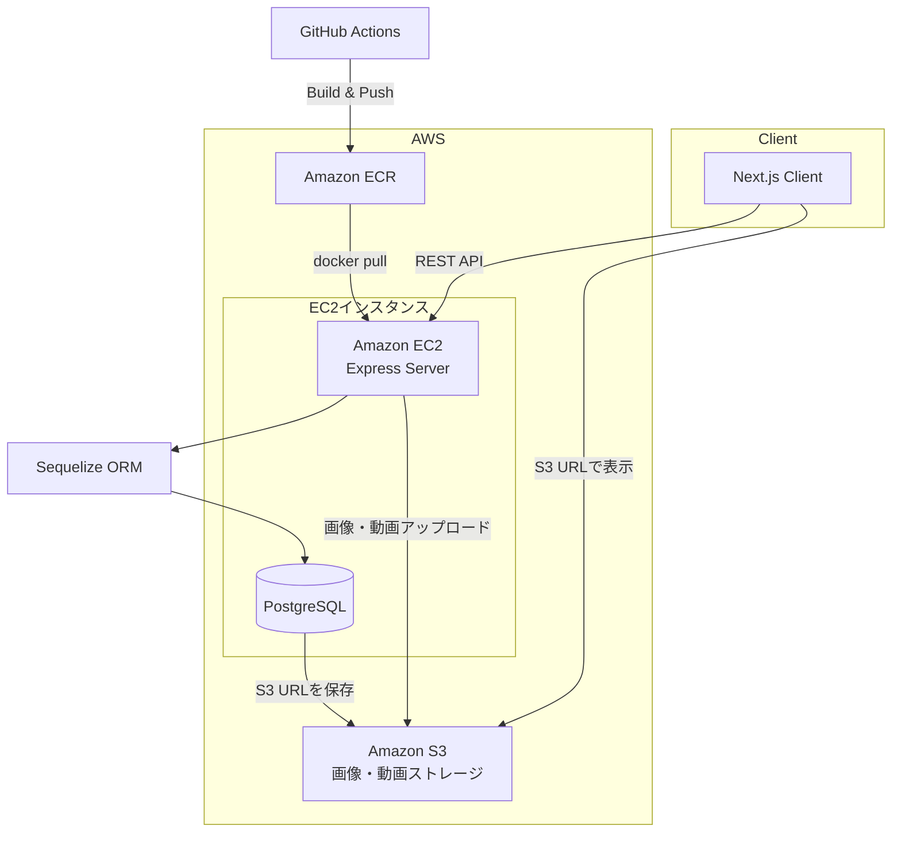

⚠ 開発中

開発者：Rednull Racing

2026/07/24版

# Project（名称未定）

## 概要

本プロジェクトは、**商品情報として動画投稿を必須とする動画中心型のECプラットフォーム**です。
出品者は動画と構造化された商品情報を組み合わせて商品を掲載でき、**BtoCおよびCtoCの両方の取引に対応**しています。

従来のECサイトでは、商品情報が画像やテキストに依存しているため、商品の理解が十分に伝わらない場合があります。
本プラットフォームでは商品情報に動画を必須とすることで、より豊富な情報を提供し、**出品者と購入者のマッチング精度の向上**を目指しています。
また、従来のマーケットプレイスシステムでは情報がテキストに依存していたため、主にセールスポイント等の情報を動画に移すことで、**UI最適化とCVR向上**を目指しています。

現在、本プロジェクトは開発中です。

## 開発の進捗

2026年7月24日現在の開発進捗

### フロントエンド

ページ単位では**63%**完成。

商品ページ・ユーザー登録および個人情報登録・認証系・検索系・商品リスト系・その他インプット系・規約・ガイドが完成。決済系・取引系・チャット系・トップページ・LP・売上管理・管理者機能は未実装。

一部、以前のサービス（アウトドア系CtoC EC）から未改修の部分あり。

### バックエンド

Sequelizeモデル・APIルート・ユースケース層・サービス層を、フロントエンドと連動して開発中。その他、cron、認証ミドルウェア、インフラ、マイグレーション等も並行して開発中。

---

# 主な機能・設計

1. **動画を活用した商品出品機能**

    商品出品時に動画の投稿を必須とすることで、よりリッチな商品情報を提供できる仕組みを構築します。

2. **モバイル最適化されたシングルスクリーン商品ページ**

    スマートフォンでは、動画・商品情報・購入操作などの主要要素が
    **1画面内で把握できるUI**として設計されています。

    これにより、スクロールを必要とせずに商品理解と購入操作が可能になります。

3. **2種類のUIを切り替え可能な商品リスト**

    商品一覧は以下の2つの表示形式を切り替えることができます。
    - 動画サムネイル表示
    - 商品カード表示

4. **多ジャンル展開を前提としたスケーラブルな設計**

    現在はアパレル分野を中心に開発していますが、将来的に**複数の商品ジャンルへ拡張可能なアーキテクチャ**を採用しています。

---

# UIサンプル

### 商品ページ


モバイルUIでは、動画・商品説明・購入手続きがすべて1画面で収まるように設計されています。PCでも、これらを近い位置に配置し、迷いのない設計になっています。また、薄いグレー背景の概要セクションをクリックすることで、詳細情報が書かれたセクションへ遷移します。


---

# 技術スタック

### フロントエンド

- Next.js（App Router）
- TypeScript
- CSS Modules
- SWR
- NextAuth.js


### バックエンド

- Node.js
- Express
- Sequelize ORM
- TypeScript
- JWT
- bcrypt
- Multer
- FFmpeg


### データベース

- PostgreSQL


### ストレージ

- Amazon S3


### インフラ / デプロイ

- Docker
- Amazon EC2
- Amazon ECR
- GitHub Actions


### バージョン管理

- Git
- GitHub


## 技術選定理由

| 技術                 | 選定理由                                                                                                          |
| -------------------- | ----------------------------------------------------------------------------------------------------------------- |
| Next.js (App Router) | SSR・SSGを柔軟に使い分けられ、SEOと表示速度を両立できるため                                                       |
| TypeScript           | フロント・バック共通で型安全に開発でき、スケール時のバグを減らせるため                                            |
| Express              | シンプルで学習コストが低く、柔軟なルーティング設計ができるため                                                    |
| Sequelize            | TypeScriptとの親和性が高く、マイグレーション管理が容易なため                                                      |
| PostgreSQL           | リレーション設計が複雑なECデータ（商品・注文・ユーザー）に適しているため                                          |
| Amazon S3            | 大容量の画像・動画ファイルを低コストかつ高可用性で保存できるため。DBにはURLのみ保存し、ファイル管理を分離する設計 |
| Docker               | 開発環境と本番環境を統一し、環境差異によるトラブルを防止できるため                                                |
| Amazon EC2           | 権限やスケーラビリティ等設計の自由度が高いのと、パフォーマンス最適化を図るため                                    |
| Amazon ECR           | Dockerイメージを安全に管理でき、EC2へのデプロイを効率化できるため                                                 |
| GitHub Actions       | ビルド・テスト・デプロイを自動化し、CI/CDを実現するため                                                           |

## システム構成



## 開発環境

| 環境     | 内容   |
| -------- | ------ |
| OS       | Ubuntu |
| コンテナ | Docker |

ローカル開発・テストは Docker コンテナ上で動作確認しています。

---

# プロジェクト構成

web-project1

/client
フロントエンドアプリケーション（Next.js）

/server
バックエンドAPI（Node.js + Express）

/docs
アーキテクチャおよび技術ドキュメント

---

# セットアップ

リポジトリをクローン

```
git clone https://github.com/daddydirty420-app/web-project1
```

依存関係をインストール

```
cd client
npm install

cd ../server
npm install
```

開発サーバーを起動

client

```
npm run dev
```

server

```
npm run dev
```

---

# 現在実装されている機能

フロントエンドのページ単位では **63%** 完了（7月24日現在）

- 商品ページ
- 商品出品機能
- ユーザー認証
- ユーザープロフィール
- 商品リスト
- お知らせ
- 商品検索機能
- フォロー機能
- コメント機能
- ショップ登録
- 振込関連機能
- お問い合わせ機能
- ユーザーガイド
- 利用規約・ポリシー関連ページ

---

# 直近の実装予定

- 注文 / 決済 / 取引機能
- メール通知機能
- トップページ / LP（ランディングページ）
- 管理者ツール

---

# 今後の計画

- レコメンド機能
- 機械学習の導入
- 多ジャンル展開
- 決済ゲートウェイ連携
- モバイルアプリ開発
- 配送API連携

---

# 開発者

GitHub: https://github.com/daddydirty420-app

Rednull Racing

エンジニア1年目として、最初のWebアプリフルスタック開発に挑戦中。2026年内リリースを目指す。

以前はノーコードツール Bubble を使って同様のWebアプリを2つ開発。
1つ目はPVが伸びず撤退、2つ目はパフォーマンスが目標水準に達せず断念。

パフォーマンス課題の解決と機能拡張を目的に、 Typescript を用いたフルスタック開発を行っている。

### AI 利用方針

ChatGPT・Claude などのLLMと設計や実装について壁打ちしながら開発を進める。
ただし Claude Code・Codex などのコーディングエージェントは使用しない方針。
基本的な設計・実装の技術的理解を、手を動かすことで深めることを重視しているため。要件や設計があいまいなものに対するコーディングエージェントでの実装による技術的負債リスクも考慮している。

# ライセンス

本リポジトリは個人学習・事業用途・技術力証明用途で公開しています。
無断でのコードの複製・使用・改変・再配布は禁止します。

コードの利用・転用などを検討される方は以下の問い合わせ先へご相談ください。

# お問い合わせ・ご相談

以下の理由でコードの利用やリポジトリの利用を検討されている方は、お気軽に下記メールアドレスからRednull Racing宛てにご相談ください。

- 学習用途でコードを利用したい
- コードの利用・ライセンスについて相談したい
- アドバイスしたい
- バグ・改善点を教えたい
- 開発に参加したい
- 事業化したい
- 販売商品ジャンルを変更して事業化したい
- 商品販売者として開発段階から関わりたい
- 開発主（Rednull Racing）と共同なら事業化したい
- スポンサー・投資・協業について相談したい
- 開発者として興味を持った
- 情報交換・意見交換したい
- 開発主とお話ししたい
- メディア掲載・取材について相談したい

お問い合わせ先：newproject893420@gmail.com

その他の理由で開発主に問い合わせしたい場合でも、どうぞお気軽に上記メールアドレスからお問い合わせください。
