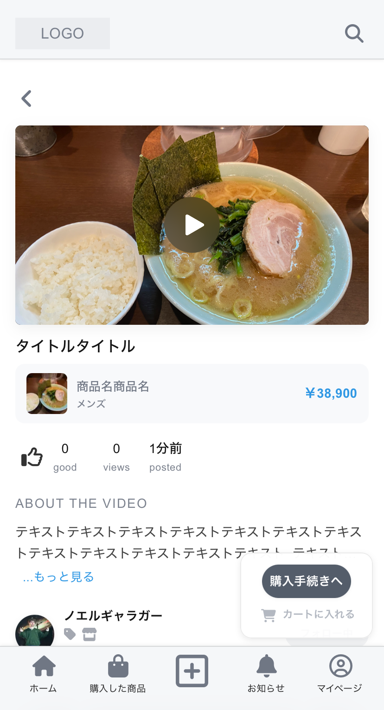
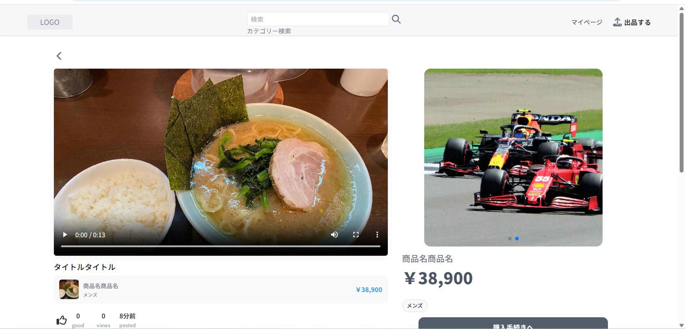
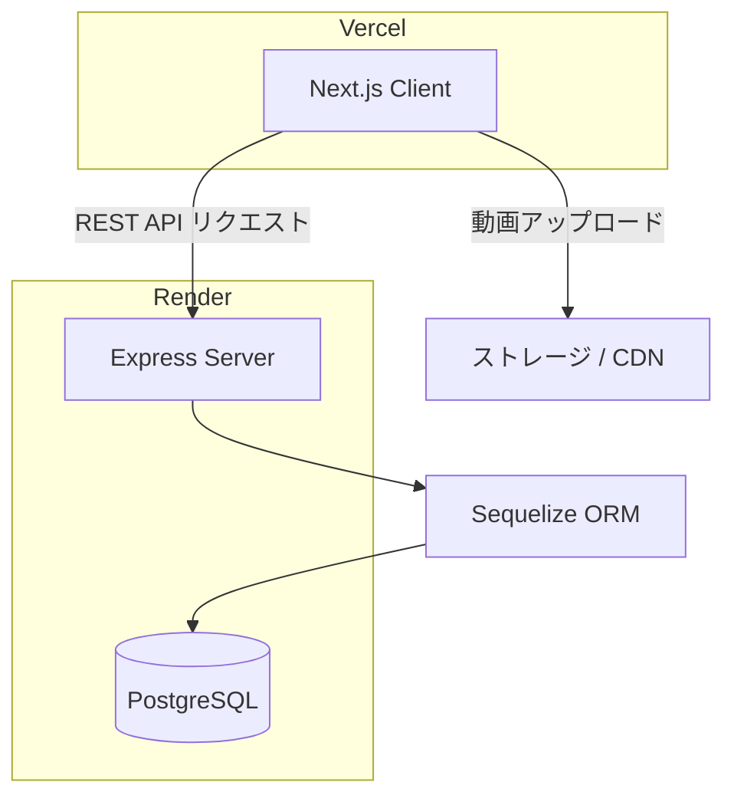

🇺🇸 English version: README.en.md

# Web Project 1

## 概要

本プロジェクトは、**商品情報として動画投稿を必須とする動画中心型のECプラットフォーム**です。
出品者は動画と構造化された商品情報を組み合わせて商品を掲載でき、**BtoCおよびCtoCの両方の取引に対応**しています。

従来のECサイトでは、商品情報が画像やテキストに依存しているため、商品の理解が十分に伝わらない場合があります。
本プラットフォームでは商品情報に動画を必須とすることで、より豊富な情報を提供し、**出品者と購入者のマッチング精度の向上**を目指しています。

現在、本プロジェクトは開発中です。

## 開発の進捗

2026年4月15日現在の開発進捗

### フロントエンド

商品ページ・ユーザー登録および個人情報登録・認証系・その他インプット系・規約・ガイドが完成。決済系・取引系・チャット系・検索機能（一部を除く）・トップページ・LP・売上管理・管理者機能は未実装。

一部、以前のサービス（アウトドア系EC）から未改修の部分あり。

### バックエンド

Sequelizeモデル・APIルート・ユースケース層・サービス層を、フロントエンドと連動して開発中。その他、cron、認証ミドルウェア、インフラ、マイグレーション等も並行して開発中。ルートハンドラのREST API設計への改修と、/usecase、/serviceへの内部処理の依存関係の分離と一部抽象化も並行してリファクタ中。

---

# 主な目的

1. **動画を活用した商品出品機能**

   商品出品時に動画の投稿を必須とすることで、よりリッチな商品情報を提供できる仕組みを構築します。

2. **モバイル最適化されたシングルスクリーン商品ページ**

   スマートフォンでは、動画・商品情報・購入操作などの主要要素が
   **1画面内で把握できるUI**として設計されています。

   これにより、スクロールを必要とせずに商品理解と購入操作が可能になります。

3. **2種類のUIを切り替え可能な商品リスト**

   商品一覧は以下の2つの表示形式を切り替えることができます。

   * 動画サムネイル表示
   * 商品カード表示

4. **多ジャンル展開を前提としたスケーラブルな設計**

   現在はアパレル分野を中心に開発していますが、将来的に**複数の商品ジャンルへ拡張可能なアーキテクチャ**を採用しています。

---

# UIサンプル

### 商品ページ



モバイルUIでは、動画・商品説明・購入手続きがすべて1画面で収まるように設計されています。PCでも、これらを近い位置に配置し、迷いのない設計になっています。



---

# 技術スタック

### フロントエンド

* Next.js（App Router）
* TypeScript


### バックエンド

* Node.js
* Express
* Sequelize ORM
* Typescript


### データベース

* PostgreSQL

### インフラ / デプロイ

* Vercel（フロントエンド）
* Render（バックエンド・DB）


## 技術選定理由

| 技術 | 選定理由 |
|------|---------|
| Next.js (App Router) | SSR・SSGを柔軟に使い分けられ、SEOと表示速度を両立できるため |
| TypeScript | フロント・バック共通で型安全に開発でき、スケール時のバグを減らせるため |
| Express | シンプルで学習コストが低く、柔軟なルーティング設計ができるため |
| Sequelize | TypeScriptとの親和性が高く、マイグレーション管理が容易なため |
| PostgreSQL | リレーション設計が複雑なECデータ（商品・注文・ユーザー）に適しているため |
| Vercel | Next.jsとの親和性が非常に高く、App RouterのSSR/ISRに最適化されており、無料で利用できるため |
| Render | Node.js + Expressのデプロイが簡単で、無料枠から始められコスト効率が良いため |

## システム構成



---

# プロジェクト構成

web-project1

/client
フロントエンドアプリケーション（Next.js）

/server
バックエンドAPI（Node.js + Express）

/docs
アーキテクチャおよび技術ドキュメント

---

# セットアップ

リポジトリをクローン

```
git clone https://github.com/daddydirty420-app/web-project1
```

依存関係をインストール

```
cd client
npm install

cd ../server
npm install
```

開発サーバーを起動

client

```
npm run dev
```

server

```
npm run dev
```

---

# 現在実装されている機能

* 商品ページ
* 商品出品機能
* ユーザー認証
* ユーザープロフィール
* 商品リスト
* フォロー機能
* コメント機能
* ショップ登録
* 振込関連機能
* お問い合わせ機能
* ユーザーガイド
* 利用規約・ポリシー関連ページ

---

# 直近の実装予定

* 注文 / 決済 / 取引機能
* お知らせ・メール通知機能
* トップページ / LP（ランディングページ）
* 管理者ツール

---

# 今後の計画

* モバイルアプリ開発
* レコメンド機能
* 機械学習の導入
* 多ジャンル展開
* 配送API連携
* 決済ゲートウェイ連携

---

# 作者

GitHub
https://github.com/daddydirty420-app
