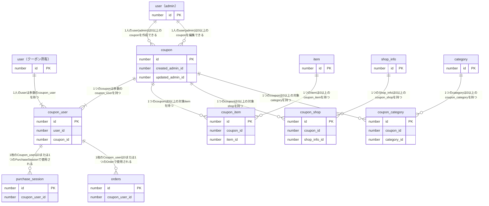

# クーポン系DB ER図

```mermaid
erDiagram

user（クーポン所有） {
    number id PK
}

user（admin） {
    number id PK
}

coupon {
    number id PK
    number created_admin_id
    number updated_admin_id
}

coupon_user {
    number id PK
    number user_id
    number coupon_id
}

purchase_session {
    number id PK
    number coupon_user_id
}

orders {
    number id PK
    number coupon_user_id
}

item {
    number id PK
}

shop_info {
    number id PK
}

category {
    number id PK
}

coupon_item {
    number id PK
    number coupon_id
    number item_id
}

coupon_shop {
    number id PK
    number coupon_id
    number shop_info_id
}

coupon_category {
    number id PK
    number coupon_id
    number category_id
}

user（クーポン所有） ||--|{ coupon_user : "1人のuserは多数のcoupon_userを持つ"

coupon ||--|{ coupon_user : "1つのcouponは多数のcoupon_userを持つ"

user（admin） ||--o{ coupon : "1人のuser(admin)は0以上のcouponを作成できる"

user（admin） ||--o{ coupon : "1人のuser(admin)は0以上のcouponを編集できる"

coupon_user ||--o{ purchase_session : "1枚のCoupon_userは0または1つのPurchaseSessionで使用される"

coupon_user ||--o{ orders : "1枚のCoupon_userは0または1つのOrderで使用される"

item ||--o{ coupon_item : "1つのitemは0以上のcoupon_itemを持つ"

shop_info ||--o{ coupon_shop : "1つのShop_infoは0以上のcoupon_shopを持つ"

category ||--o{ coupon_category : "1つのcategoryは0以上のcoupon_categoryを持つ"

coupon ||--o{ coupon_item : "1つのcouponは0以上の対象itemを持つ"

coupon ||--o{ coupon_shop : "1つのcouponは0以上の対象shopを持つ"

coupon ||--o{ coupon_category : "1つのcouponは0以上の対象categoryを持つ"
```
