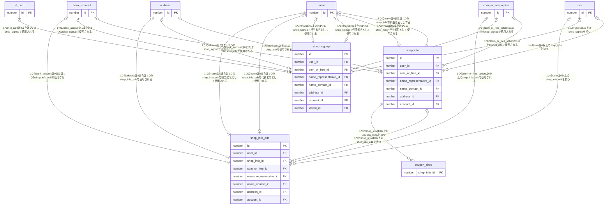

# ショップ系DB ER図

```mermaid
erDiagram

user {
    number id PK
}

com_or_free_option {
    number id PK
}

name {
    number id PK
}

address {
    number id PK
}

bank_account {
    number id PK
}

id_card {
    number id PK
}

shop_info {
    number id PK
    number user_id FK
    number com_or_free_id FK
    number name_representative_id FK
    number name_contact_id FK
    number address_id FK
    number account_id FK
}

shop_signup {
    number id PK
    number user_id FK
    number com_or_free_id FK
    number name_representative_id FK
    number name_contact_id FK
    number address_id FK
    number account_id FK
    number idcard_id FK
}

shop_info_edit {
    number id PK
    number user_id FK
    number shop_info_id FK
    number com_or_free_id FK
    number name_representative_id FK
    number name_contact_id FK
    number address_id FK
    number account_id FK
}

coupon_shop {
    number shop_info_id FK
}

user o|--o{ shop_info : "1人のuserは0以上のshop_infoを持つ"

user o|--o{ shop_signup : "1人のuserは0以上のshop_signupを持つ"

user o|--o{ shop_info_edit : "1人のuserは0以上のshop_info_editを持つ"

com_or_free_option o|--o{ shop_info : "1つのcom_or_free_optionは0以上のshop_infoで使用される"

com_or_free_option o|--o{ shop_signup : "1つのcom_or_free_optionは0以上のshop_signupで使用される"

com_or_free_option o|--o{ shop_info_edit : "1つのcom_or_free_optionは0以上のshop_info_editで使用される"

name o|--o| shop_info : "1つのnameは0または1つのshop_infoで代表者名として使用される"

name o|--o| shop_info : "1つのnameは0または1つのshop_infoで担当者名として使用される"

name o|--o| shop_signup : "1つのnameは0または1つのshop_signupで代表者名として使用される"

name o|--o| shop_signup : "1つのnameは0または1つのshop_signupで担当者名として使用される"

name o|--o| shop_info_edit : "1つのnameは0または1つのshop_info_editで代表者名として使用される"

name o|--o| shop_info_edit : "1つのnameは0または1つのshop_info_editで担当者名として使用される"

address o|--o| shop_info : "1つのaddressは0または1つのshop_infoで使用される"

address o|--o| shop_signup : "1つのaddressは0または1つのshop_signupで使用される"

address o|--o| shop_info_edit : "1つのaddressは0または1つのshop_info_editで使用される"

bank_account o|--o| shop_info : "1つのbank_accountは0または1つのshop_infoで使用される"

bank_account o|--o| shop_signup : "1つのbank_accountは0または1つのshop_signupで使用される"

bank_account o|--o| shop_info_edit : "1つのbank_accountは0または1つのshop_info_editで使用される"

id_card o|--o| shop_signup : "1つのid_cardは0または1つのshop_signupで使用される"

shop_info o|--o{ shop_info_edit : "1つのshop_infoは0以上のshop_info_editを持つ"

shop_info ||--o{ coupon_shop : "1つのshop_infoは0以上のcoupon_shopを持つ"
```
