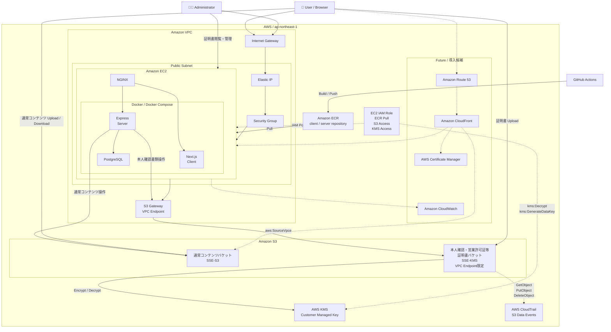
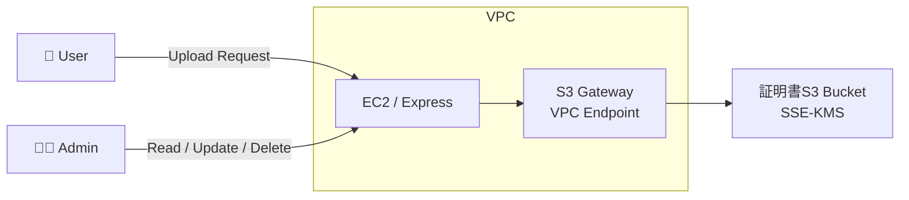

# AWS アーキテクチャ構成

## 概要

- Region: ap-northeast-1
- Compute: Amazon EC2
- Container Registry: Amazon ECR
- Object Storage: Amazon S3
- Encryption: SSE-S3 / SSE-KMS
- Audit: AWS CloudTrail

## アーキテクチャ構成図



### 本人確認・営業許可証バケット 詳細フロー



## ネットワーク

### VPC

### パブリックサブネット

### インターネットゲートウェイ

### Elastic IP

### セキュリティーグループ

### S3 Gateway VPC Endpoint

## コンピューティング

### EC2

- NGINX
- Docker
- Docker Compose
- Next.js
- Express
- PostgreSQL

### EC2の公開経路

- Elastic IPをEC2へ関連付け
- HTTP/HTTPS通信はNGINXで受け付ける
- `/app` はNext.js、`/api` はExpressへリバースプロキシ

## コンテナ

### ECR

- client repository
- server repository

```
GitHub Actions
↓
ECR
↓
EC2
```

## ストレージ

### S3

- 通常コンテンツバケット
- 本人確認・営業許可証等証明書バケット

本人確認・営業許可証バケットは、ユーザーは書き込みのみ、管理者は全操作可。

### VPC Endpoint Restricted Bucket

本人確認・営業許可証バケットは特定のVPC Endpoint経由のみアクセス可能。

### Encryption

通常コンテンツバケットはSSE-S3を使用する。

本人確認・営業許可証バケットはSSE-KMSを使用する。

### 本人確認・営業許可証バケットへの読み取りアクセス経路

本人確認・営業許可証バケットへの読み取りは、
EC2からS3 Gateway VPC Endpoint経由で行う。

ユーザーへS3オブジェクトのパスを直接公開しない。

## IAM

### EC2 IAM Role

- ECR Pull
- S3 Access
- KMS Decrypt / GenerateDataKey

## 証跡

### CloudTrail

本人確認・営業許可証バケットのみS3 Data Eventsを記録する。

対象:

- GetObject
- PutObject
- DeleteObject

## 今後導入するかもしれないアーキテクチャ

- Amazon Route 53
- Amazon CloudFront
- Amazon CloudWatch
- AWS Certificate Manager
